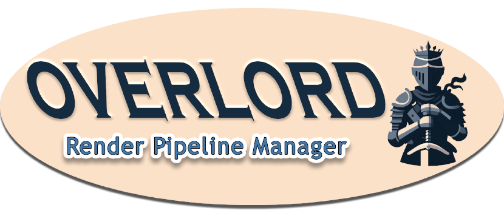

## An Asset Creation Pipeline Management Tool

Overlord is a desktop application written in [Python](https://www.Python.org/) using [Tkinter](https://docs.python.org/3/library/tkinter.html) and [Pillow](https://pypi.org/project/pillow/). It creates assets for the ARPGs made by [Laserwolve Games](https://www.LaserwolveGames.com/), like [DaggerQuest](https://www.DaggerQuest.com/) and [Plains of Shinar](https://www.PlainsOfShinar.com/). It executes scripts written in [Daz Script 2](http://docs.daz3d.com/doku.php/public/software/dazstudio/4/referenceguide/scripting/start) and manages instances of [Daz Studio](https://www.daz3d.com/).
