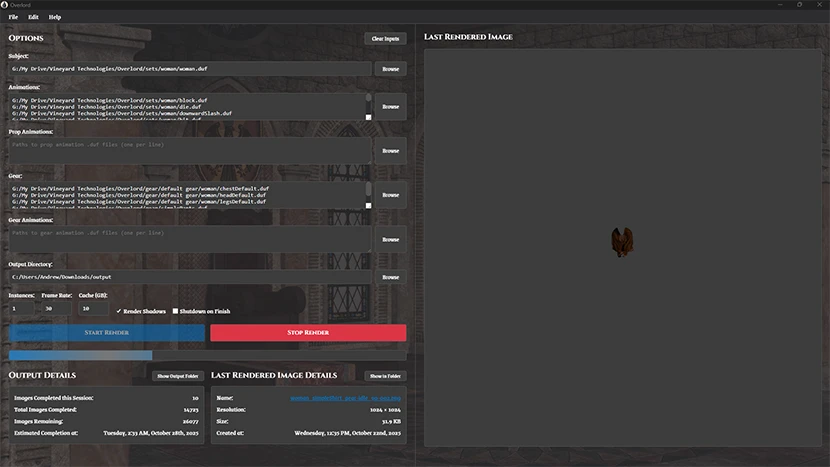

## An Asset Creation Pipeline Management Tool
#### Overlord uses [Daz Studio](https://www.daz3d.com/) and [NVIDIA Iray](https://www.nvidia.com/en-us/design-visualization/iray/) to create assets for [Construct](https://www.construct.net/en) games, like [DaggerQuest](https://www.DaggerQuest.com/) and [Plains of Shinar](https://PlainsOfShinar.com/).

Overlord features both a graphical interface for interactive use and a comprehensive command line interface for automation, testing, and headless operation.



## Installation

### Prerequisites
- **DAZ Studio 4**: Download and install from [Daz3d.com](https://www.daz3d.com/get_studio)
- **Iray Server**: Download and install from [IrayPlugins.com](https://www.irayplugins.com/)
- **Python 3.8+**: Required for running from source or building locally. Download and install from [Python.org](https://www.python.org/downloads/).

### Option 1: Install from Release (Recommended)
1. Browse to the [latest release](https://github.com/Laserwolve-Games/Overlord/releases/latest)
2. Download and run the `OverlordInstaller` executable

### Option 2: Run from Source
1. Clone this repository:
   ```bash
   git clone https://github.com/Laserwolve-Games/Overlord.git
   cd Overlord
   ```

2. Install Python dependencies:
   ```bash
   pip install -r requirements.txt
   ```

3. Run the application:
   ```bash
   python src/overlord.py
   ```

### Option 3: Build Locally
If you want to create your own executable and installer:

1. Clone this repository and navigate to the directory
2. Run the build script:
   ```bash
   python scripts/build.py
   ```
3. The script will prompt for a version number and automatically:
   - Install required dependencies
   - Build the executable
   - Create the Windows installer (if Inno Setup is available)

For detailed build instructions, see [BUILD.md](BUILD.md).

## Usage

### Getting Started
1. Launch Overlord
2. Configure your **Source Sets** - folders containing your DAZ assets (.duf files)
3. Set your **Output Directory** - where rendered images will be saved
4. Adjust rendering parameters as needed
5. Click **Start Render** to begin

## Command Line Interface

Overlord supports extensive command line arguments for automation, testing, and batch processing. All arguments can be used with both the Python script and the compiled executable.

### Basic Usage

**Python (Development):**
```bash
python src/overlord.py [options]
```

**Executable:**
```bash
overlord.exe [options]
```

### Command Line Options

#### Automation Flags
- `--startRender` - Automatically start render when application launches
- `--headless` - Run in headless mode without UI (automatically starts render)

#### Input File Arguments
- `--subject PATH` - Path to the subject .duf file
- `--animations PATH [PATH ...]` - One or more animation .duf files
- `--prop-animations PATH [PATH ...]` - One or more prop animation .duf files
- `--gear PATH [PATH ...]` - One or more gear .duf files
- `--gear-animations PATH [PATH ...]` - One or more gear animation .duf files
- `--output-dir PATH` - Output directory for rendered images

#### Render Settings
- `--instances N` - Number of render instances to run (default: 1)
- `--frame-rate N` - Frame rate for animations (default: 30)
- `--render-shadows` - Enable shadow rendering
- `--no-render-shadows` - Disable shadow rendering

### Usage Examples

#### GUI Mode with Auto-Start
```bash
# Launch GUI and automatically start render with saved settings
python src/overlord.py --startRender

# Launch GUI with specific settings and auto-start
python src/overlord.py --subject "C:/Assets/character.duf" --animations "C:/Assets/attack.duf" --output-dir "C:/Output" --instances 2 --startRender
```

#### Headless Mode (No GUI)
```bash
# Basic headless render
python src/overlord.py --headless --subject "C:/Assets/character.duf" --animations "C:/Assets/attack.duf" --output-dir "C:/Output"

# Advanced headless render with multiple files and settings
python src/overlord.py --headless \
  --subject "C:/Assets/goblin.duf" \
  --animations "C:/Assets/attack.duf" "C:/Assets/idle.duf" \
  --gear "C:/Assets/sword.duf" "C:/Assets/shield.duf" \
  --output-dir "C:/Renders" \
  --instances 2 \
  --frame-rate 24 \
  --render-shadows
```

#### Testing and Development
```bash
# Quick test with existing settings
python src/overlord.py --startRender

# Test specific configuration
python src/overlord.py --subject "test.duf" --animations "test_anim.duf" --output-dir "temp" --instances 1 --no-render-shadows --startRender
```

### Command Line Features

#### File Validation
- Automatically validates that all specified .duf files exist
- Checks file extensions are correct
- Provides clear error messages for missing or invalid files

#### Settings Override
- Command line arguments override saved settings
- Settings are still saved after UI sessions for future use
- Headless mode doesn't modify saved settings

#### Required Arguments for Headless Mode
When using `--headless`, these arguments are required:
- `--subject` - Must specify a subject file
- `--animations` - Must specify at least one animation
- `--output-dir` - Must specify output directory

#### Process Management
- Headless mode runs until completion or Ctrl+C
- Proper cleanup of DAZ Studio and Iray Server processes
- Background file monitoring and conversion
- Real-time logging to console and log file

### Integration Examples

#### Batch Processing Script
```bash
#!/bin/bash
# Render multiple characters with different animations

python src/overlord.py --headless --subject "goblin.duf" --animations "attack.duf" --output-dir "renders/goblin_attack"
python src/overlord.py --headless --subject "orc.duf" --animations "defend.duf" --output-dir "renders/orc_defend"
python src/overlord.py --headless --subject "elf.duf" --animations "magic.duf" --output-dir "renders/elf_magic"
```

#### CI/CD Pipeline
```yaml
# Example GitHub Actions step
- name: Render Assets
  run: |
    overlord.exe --headless \
      --subject "${{ github.workspace }}/assets/character.duf" \
      --animations "${{ github.workspace }}/assets/idle.duf" \
      --output-dir "${{ github.workspace }}/output" \
      --instances 1
```

#### Testing Script
```bash
# Quick validation test
python src/overlord.py --headless \
  --subject "test_character.duf" \
  --animations "test_animation.duf" \
  --output-dir "test_output" \
  --instances 1 \
  --no-render-shadows
```

### Getting Help
```bash
# View all available command line options
python src/overlord.py --help
overlord.exe --help
```

## GUI Features

### Source Sets
Source Sets are folders containing your DAZ asset files. Overlord recognizes these file types:
- `*_subject.duf` - This is a Scene Subset of either a figure or an object
- `*_animation.duf` - These are Pose Presets for the subject
- `*_gear.duf` - These are Wearables Presets for the subject
- `*_propAnimation.duf` - These are Pose Presets for objects included with the subject file
- `*_gearAnimation.duf` - These are Pose Presets for the gear files

Example Source Set directories are coming soon.

### GUI Settings
All your settings are automatically saved and restored when you restart Overlord:
- **Source Sets**: Your selected asset folders
- **Output Directory**: Where images are saved
- **Number of Instances**: How many DAZ Studio processes to run simultaneously
- **Frame Rate**: Animation frame rate for video exports
- **Log File Size**: Maximum size for log files
- **Render Shadows**: Whether to render shadow variants

### GUI Features

#### Real-time Monitoring
- **Source Set Details**: Live count of assets in your source folders
- **Output Details**: Real-time statistics of your output folder
- **Last Rendered Image**: Preview of the most recently rendered image
- **Progress Tracking**: Visual progress bar and time estimates
- **Console Output**: Live feed of rendering status and operations

#### Rendering Management
- **Multi-instance Rendering**: Run multiple DAZ Studio instances for faster processing
- **Background Processing**: Continue working while renders run in background
- **Process Control**: Stop all DAZ Studio instances with one click
- **Shadow Variants**: Indicate whether or not to also render shadows

#### Construct Archiver
- **File zipper**: Archive rendered images so they can be drag and dropped into Construct.

### File Locations
- **Settings**: `%APPDATA%/Overlord/settings.json`
- **Logs**: `%APPDATA%/Overlord/log.txt`
- **Scripts**: `%APPDATA%/Overlord/scripts/` (when running as executable)

### Troubleshooting

#### Command Line Issues
- Use `--help` to see all available options and their syntax
- In headless mode, ensure all required arguments are provided: `--subject`, `--animations`, `--output-dir`
- Check file paths are correct and files exist - Overlord validates all .duf files before starting
- For Windows paths with spaces, wrap in quotes: `--subject "C:/My Folder/character.duf"`
- Use forward slashes (/) in paths even on Windows for better compatibility

#### DAZ Studio Not Found
- Ensure DAZ Studio is installed in the default location: `C:\Program Files\DAZ 3D\DAZStudio4\`
- Check that the executable exists at the expected path

#### Rendering Issues
- Verify your source sets contain valid `.duf` files
- Check the console output for error messages
- Review the log file at `%APPDATA%/Overlord/log.txt`

## License
This project is licensed under the [AGPL 3.0 License](https://www.gnu.org/licenses/agpl-3.0.html.en) - see the [LICENSE](LICENSE) file for details.

## Contributing
Contributions are welcome! Please feel free to submit a Pull Request.

## Support
For issues and support, please visit the [Issues](https://github.com/Laserwolve-Games/Overlord/issues) page.
